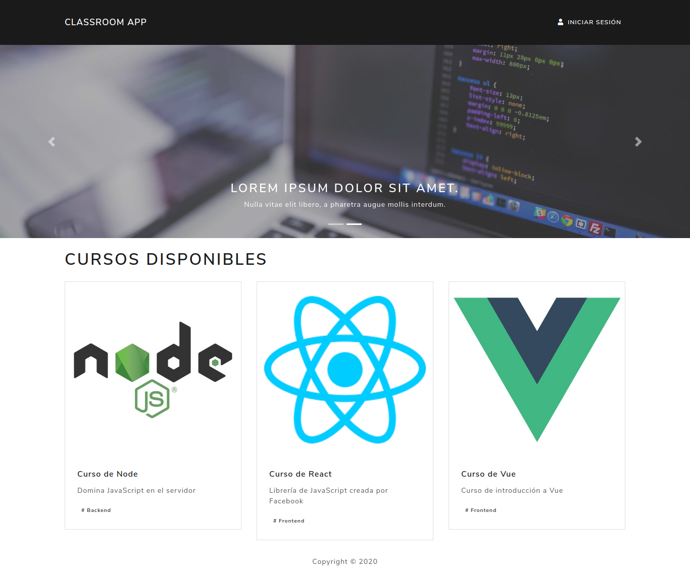

# MERN Classroom App



## Usage

Run server:

Move to `backend` folder and execute the following commands.

```
  cd backend/
  npm run build
  npm run dev
```

Run client:

Move to `frontend` folder and execute the following commands.

```
  cd frontend/
  npm start
```
